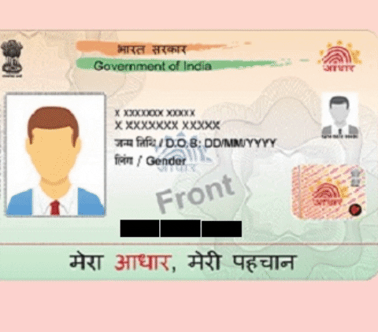

## Aadhaar Number Masking Pipeline 
Implementation of a complete pipeline that masks the Aadhaar Number in given images to adhere to Govt. of India's Privacy Guidelines for storage of Aadhaar Card images in digital repository. The following project was carried out as an internship for a leading NBFC. We make use of the open source packages CRAFT text detector | [Paper](https://arxiv.org/abs/1904.01941) | [Pretrained Model](https://drive.google.com/open?id=1Jk4eGD7crsqCCg9C9VjCLkMN3ze8kutZ) | [Github Repo](https://github.com/clovaai/CRAFT-pytorch) provided by Clova AI Research for OSD and combine a heurestic model with pytesseract OCR for masking.

**[Rohit Ranjan](https://github.com/thefurorjuror), [Ram Sundaram](https://github.com/ramsundaram101).**

### Sample Results



### Versions 
The search for the best masking pipeline led us to experiment with several different approaches. We have documented our experiments in other branches.

| Branch(->model)        | Speed/Performance | Pipeline                                     |
| ---------------------- |:-----------------:|:--------------------------------------------:|
| main                   | Best performing   | CRAFT + pytesseract + dimensional heuristics |
| CNN_OCR->cnn_model     | Fastest masking   | CRAFT + LeNet trained by us                  |
| CNN_OCR->cnn_model_2   | Fastest masking   | CRAFT + LeNet trained by us                  |
| UNET_OCDR  | Theoretically Fastest but trained model unavailable**    | UNet                   |

\*\*We proposed and implemented a pipeline which uses a single UNet model for achieving a desirable mask. A single model would have made the inference very fast and real time use capable on mobile devices. 
Training meant creating a dataset since the company could not legally provide us the needed data. After several trials, we halted work on this model because with barely 150 unique datapoints available, a data hungry UNet Model is simply unsatiable for now.
#### Datasets
Lenet was trained on our self-created labelled [dataset](https://drive.google.com/file/d/1ieFufNXsWNQL7QeetWPo8Pe36ivhirA7/view?usp=sharing) | [labels](https://drive.google.com/file/d/1oEQPeS-RMctHZFOrI3kGrT7T0zHc2Lq9/view?usp=sharing).

## Getting started
### Install dependencies
#### Requirements
- torch
- opencv-python
- tesseract-ocr
- check requirements.txt
```
pip install -r requirements.txt
#or on bash systems
#bash requirements.sh
```

### Test instructions
* Clone this repository 
```
git clone https://github.com/thefurorjuror/Aadhaar_Masker.git
```
* Run on an image folder
``` (with python 3.7)
python [folder path to the cloned repo]/masker.py --test_folder=[folder path to test images] --output_folder=[folder path to output images] --cuda=[True/False]
#Example- When one is inside the cloned repo
python masker.py --test_folder=./images/ --output_folder=./output/ --cuda=True
```

cuda is set to False by default.


## Citation
```
@inproceedings{baek2019character,
  title={Character Region Awareness for Text Detection},
  author={Baek, Youngmin and Lee, Bado and Han, Dongyoon and Yun, Sangdoo and Lee, Hwalsuk},
  booktitle={Proceedings of the IEEE Conference on Computer Vision and Pattern Recognition},
  pages={9365--9374},
  year={2019}
}
```

## License
```
Copyright (c) 2021-present Rohit Ranjan & Ram Sundaram.

Permission is hereby granted, free of charge, to any person obtaining a copy
of this software and associated documentation files (the "Software"), to deal
in the Software without restriction, including without limitation the rights
to use, copy, modify, merge, publish, distribute, sublicense, and/or sell
copies of the Software, and to permit persons to whom the Software is
furnished to do so, subject to the following conditions:

The above copyright notice and this permission notice shall be included in
all copies or substantial portions of the Software.

THE SOFTWARE IS PROVIDED "AS IS", WITHOUT WARRANTY OF ANY KIND, EXPRESS OR
IMPLIED, INCLUDING BUT NOT LIMITED TO THE WARRANTIES OF MERCHANTABILITY,
FITNESS FOR A PARTICULAR PURPOSE AND NONINFRINGEMENT.  IN NO EVENT SHALL THE
AUTHORS OR COPYRIGHT HOLDERS BE LIABLE FOR ANY CLAIM, DAMAGES OR OTHER
LIABILITY, WHETHER IN AN ACTION OF CONTRACT, TORT OR OTHERWISE, ARISING FROM,
OUT OF OR IN CONNECTION WITH THE SOFTWARE OR THE USE OR OTHER DEALINGS IN
THE SOFTWARE.
```
